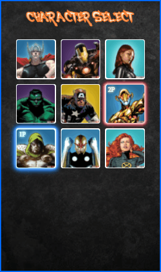

<h1 align="center">
  
</h1>

Este projeto foi feito no evento MapaDev Week do @devemdobro. O objetivo do evento era criarmos um projeto web que seria um Character Select com personagens da Marvel. Para o projeto foi utilizando HTML, CSS e um pouco de JavaScript.

 [👀 Visualize o projeto clicando aqui](https://revertemayene.github.io/mapadevweek-characterselect-marvel/)

 

 

## 🖥️ Prévia para Desktop

<h1 align="center">

 

  

  
</h1>

## 📱 Prévia para Mobile

<h1 align="center">

 

  

  
</h1>

## 🔥 Meus desafios

Meu maior desafio neste projeto foi a criação do responsivo para mobile que ainda não ficou muito claro, mas estou sempre em busca de melhorar. A parte do JavaScript também não ficou muito clara, mas os estudos não param.

  

## 🚀 Tecnologias utilizadas

✔️ HTML5

✔️ CSS3

✔️ JavaScript

  

Feito com o ❤️ por Mayene Reverte [Meu linkedIn](https://www.linkedin.com/in/mayenereverte/)

Criado em maio/2022

